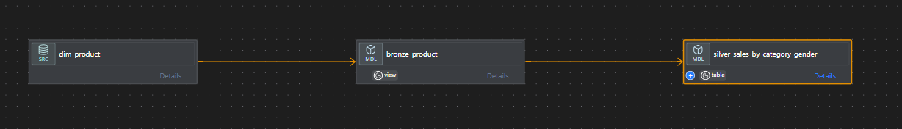
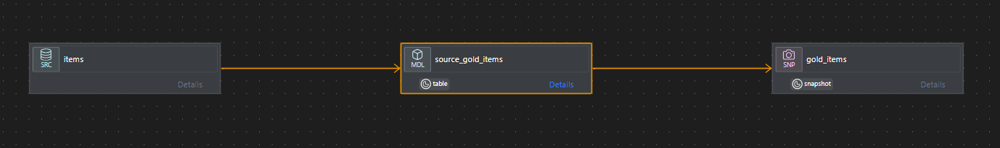

## dbt_tutorial on Databricks ✨

This repository contains a dbt Core project running on Databricks, implementing the Medallion architecture and environment-aware deployments.

### Highlights
- 🧱 Medallion layers: bronze → silver → gold
  - Bronze (staging): `bronze_date`, `bronze_product`, `bronze_store`, `bronze_returns`, `bronze_sales`
  - Silver (curated): `silver_sales_by_category_gender`, `silver_returns_by_store_month_reason`
  - Gold (analytics): reserved for downstream marts and snapshots `gold_items`
- ✅ Data quality: built-in tests via `schema.yml` and a custom generic test `generic_non_negative`
- 🧩 Reuse: `multiply` macro for numeric expressions
- 🌐 Environments: catalogs are parameterized via `{{ target.catalog }}` for dev/prod

### Tech stack
- dbt Core 1.10.x
- dbt-databricks 1.10.x
- Databricks SQL Warehouse (or All-purpose cluster)

### Project structure
- `models/bronze/` — source-aligned staging models
- `models/silver/` — curated transforms and aggregates
- `models/*/schema.yml` — documentation and tests
- `snapshots/` — snapshot definitions (e.g., `gold_items.yml`)
- `macros/` — reusable Jinja utilities (e.g., `multiply`)
- `tests/generic/` — custom generic tests (e.g., `generic_non_negative`)
- `analyses/` — exploratory SQL (e.g., `target_variables.sql`)

### Setup
1) Create a virtual environment and install deps
   - `pip install -r requirements.txt`
2) Configure Databricks profile (`profiles.yml` → `dbt_tutorial`)
   - `host`, `http_path`, `token`, default `catalog` and `schema`
   - See `profiles-sample.yml` for dev/prod targets
3) Verify
   - `dbt debug`
   - `dbt parse`

### Common commands
- Build bronze+silver: `dbt build --select tag:bronze+ tag:silver`
- Run silver only: `dbt run --select path:models/silver`
- Run tests: `dbt test`
- Docs: `dbt docs generate && dbt docs serve`

### Environment targets 🌐
This project uses `{{ target.catalog }}` so you can deploy per environment:
- Dev: `dbt build --target dev`
- Prod: `dbt build --target prod`

### Snapshots ⏱️
- Example: `snapshots/gold_items.yml` (timestamp strategy)
- Use snapshots to track history (SCD-like) for selected entities

#### SCD Type 2 (SCD2)
This project implements SCD2 for `gold_items` via a timestamp-based snapshot. Records are preserved over time using a `unique_key` and an `updated_at` column.

```yaml
snapshots:
  - name: gold_items
    relation: ref('source_gold_items')
    config:
      schema: gold
      database: '{{ target.catalog }}'
      unique_key: id
      strategy: timestamp
      updated_at: updated_at
```

Run snapshots by environment:
- Dev: `dbt snapshot --target dev`
- Prod: `dbt snapshot --target prod`

### Data lineage 🔗
- Silver depends on bronze via `ref()`, bronze depends on sources via `source()`
- In the VS Code dbt Power User graph, increase parent depth to see `source → bronze → silver`

#### Visuals
- Silver model lineage (sales by category and gender):



- Gold model lineage (snapshot-backed items):



### CI/CD (recommended) 🤖
Example steps:
```yaml
steps:
  - run: dbt deps
  - run: dbt build --target dev --warn-error
  - run: dbt build --target prod --select state:modified+ --defer --state ./target
  - run: dbt docs generate
```

### Development tips 💡
- Prefer `ref()` and `source()` over hard-coded names
- Use tags/paths to target layers for fast iteration
- Preview compiled SQL and browse the DAG with the dbt Power User extension
